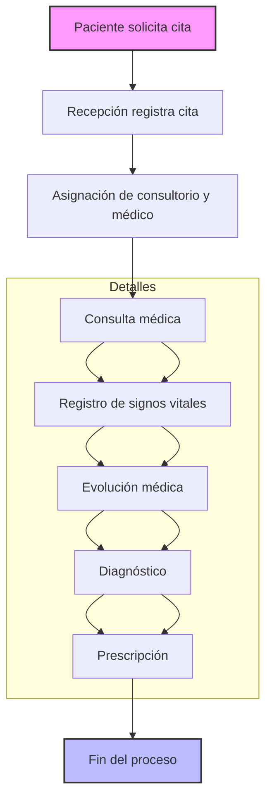
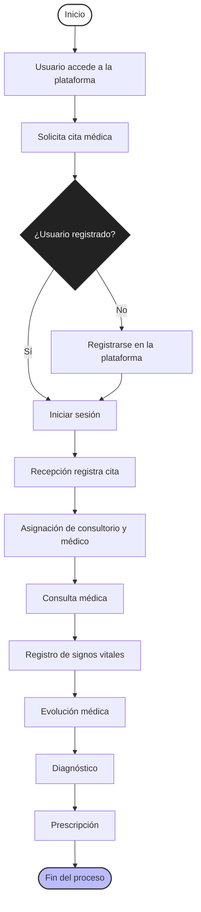

# Diagrama de Procesos

A continuación se muestra un diagrama de procesos básico para el flujo principal de atención médica en el sistema EHR, basado en las entidades y relaciones del diccionario de datos:

> Este diagrama representa el flujo típico de atención médica: desde la solicitud de cita por parte del paciente, pasando por la consulta, registro de signos vitales, evolución, diagnóstico y prescripción, hasta el cierre del proceso.

Además, se presenta otro diagrama que incluye el proceso de registro y acceso del usuario a la plataforma:

> Este diagrama representa el flujo de procesos típico en la atención médica del sistema EHR, incluyendo registro, solicitud de cita, consulta, registro de signos vitales, evolución, diagnóstico y prescripción.
