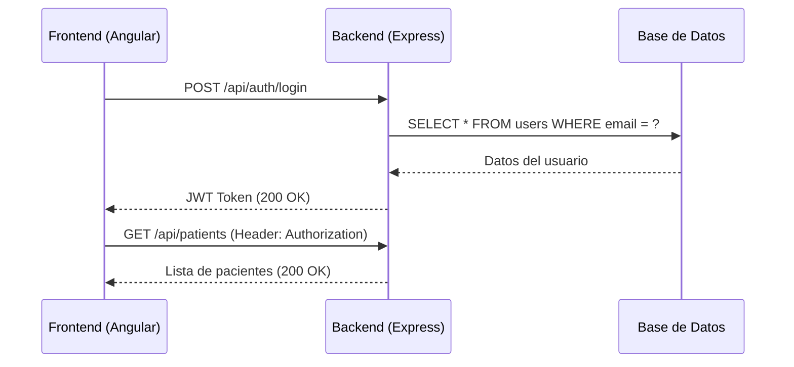

# Flujo de Autenticación

```mermaid
sequenceDiagram
  participant Frontend as Frontend (Angular)
  participant Backend as Backend (Express)
  participant DB as Base de Datos

  Frontend->>Backend: POST /api/auth/login
  Backend->>DB: SELECT * FROM users WHERE email = ?
  DB-->>Backend: Datos del usuario
  Backend-->>Frontend: JWT Token (200 OK)
  Frontend->>Backend: GET /api/patients (Header: Authorization)
  Backend-->>Frontend: Lista de pacientes (200 OK)
```

> **Nota:** Este diagrama muestra el flujo completo de autenticación.