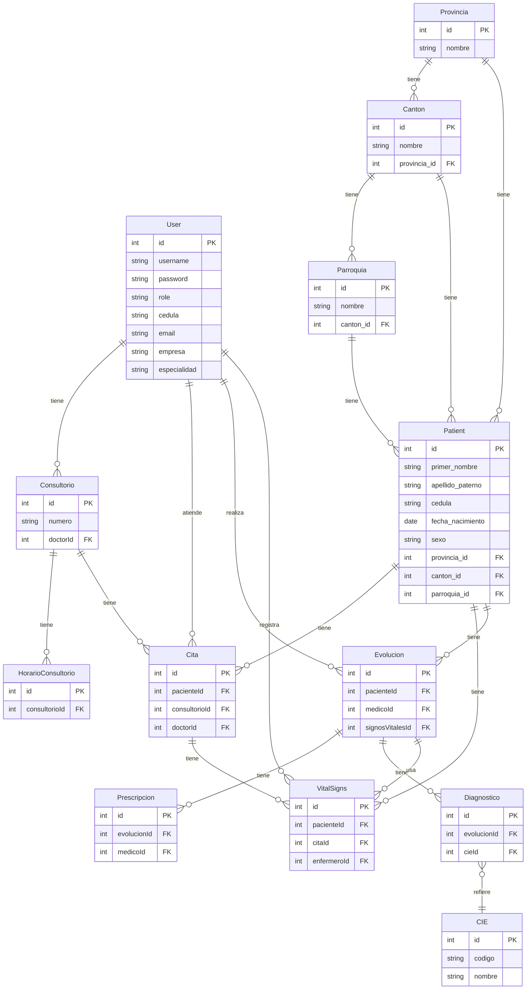

# Diagrama Entidad-Relación

```mermaid
erDiagram
  User {
    int id PK
    string username
    string password
    string role
    string cedula
    string email
    string empresa
    string especialidad
  }
  Patient {
    int id PK
    string primer_nombre
    string apellido_paterno
    string cedula
    date fecha_nacimiento
    string sexo
    int provincia_id FK
    int canton_id FK
    int parroquia_id FK
  }
  Provincia {
    int id PK
    string nombre
  }
  Canton {
    int id PK
    string nombre
    int provincia_id FK
  }
  Parroquia {
    int id PK
    string nombre
    int canton_id FK
  }
  Consultorio {
    int id PK
    string numero
    int doctorId FK
  }
  HorarioConsultorio {
    int id PK
    int consultorioId FK
  }
  Cita {
    int id PK
    int pacienteId FK
    int consultorioId FK
    int doctorId FK
  }
  VitalSigns {
    int id PK
    int pacienteId FK
    int citaId FK
    int enfermeroId FK
  }
  Evolucion {
    int id PK
    int pacienteId FK
    int medicoId FK
    int signosVitalesId FK
  }
  Prescripcion {
    int id PK
    int evolucionId FK
    int medicoId FK
  }
  Diagnostico {
    int id PK
    int evolucionId FK
    int cieId FK
  }
  CIE {
    int id PK
    string codigo
    string nombre
  }

  User ||--o{ Consultorio : "tiene"
  User ||--o{ Cita : "atiende"
  User ||--o{ Evolucion : "realiza"
  User ||--o{ VitalSigns : "registra"
  Patient ||--o{ Cita : "tiene"
  Patient ||--o{ VitalSigns : "tiene"
  Patient ||--o{ Evolucion : "tiene"
  Provincia ||--o{ Canton : "tiene"
  Canton ||--o{ Parroquia : "tiene"
  Provincia ||--o{ Patient : "tiene"
  Canton ||--o{ Patient : "tiene"
  Parroquia ||--o{ Patient : "tiene"
  Consultorio ||--o{ HorarioConsultorio : "tiene"
  Consultorio ||--o{ Cita : "tiene"
  Cita ||--o{ VitalSigns : "tiene"
  Evolucion ||--o{ Prescripcion : "tiene"
  Evolucion ||--o{ Diagnostico : "tiene"
  Evolucion ||--o{ VitalSigns : "usa"
  Diagnostico }o--|| CIE : "refiere"
```